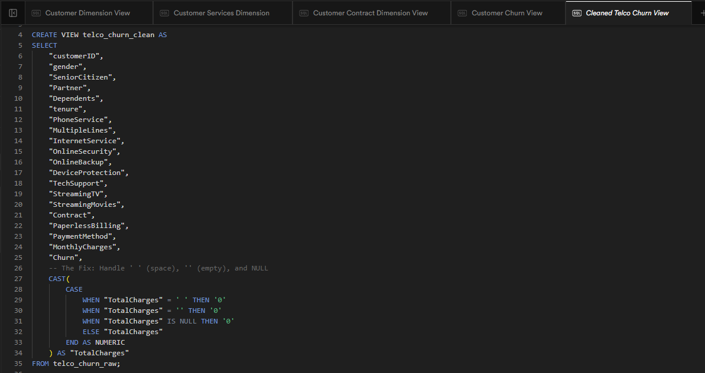
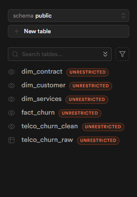
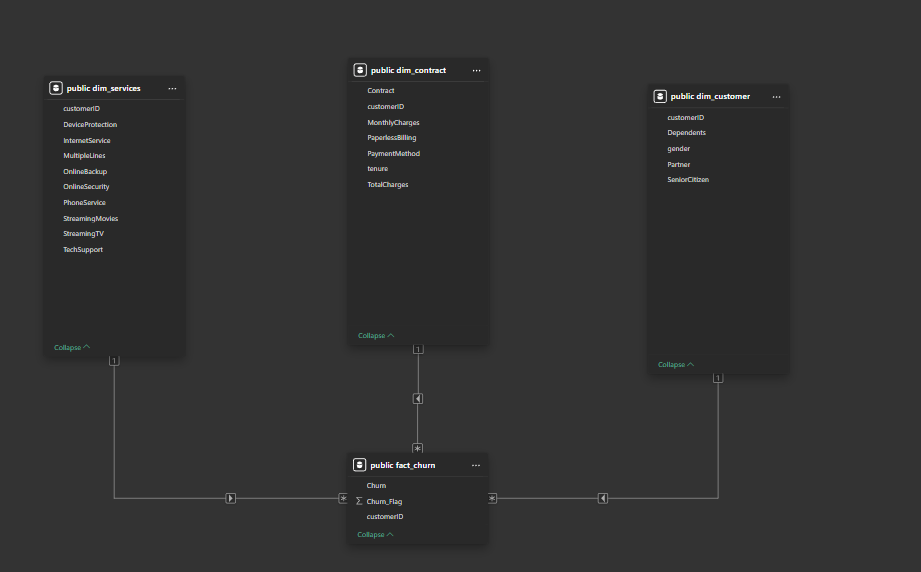

# Telco Customer Churn & Retention Analytics

**End-to-end data engineering and analytics project designed to identify customer churn drivers and calculate retention metrics. Built using a hybrid cloud stack (Supabase PostgreSQL + Power BI) to demonstrate backend data modeling and frontend visualization mastery.**

---

## Project Goal
Create a "Backend Mastery" portfolio project that moves beyond standard CSV reporting by implementing:
- **Cloud Database Infrastructure**: Hosting data on Supabase (PostgreSQL).
- **SQL-First ETL**: Performing data cleaning and transformation using SQL Views (ELT methodology) instead of Power Query.
- **Star Schema Modeling**: Architecting a PL-300 compliant data model in Power BI.
- **Advanced Analytics**: (Planned V3) Python integration for churn prediction.

## Tech Stack
- **Database**: Supabase (PostgreSQL 15) - Cloud-hosted on AWS.
- **ETL/Transformation**: SQL (Views & Type Casting).
- **Visualization**: Power BI Desktop.
- **Environment**: Hybrid (Personal PC for DB management, Work Laptop constraints bypassed via Cloud Auth).

---

## V1: Backend Setup & Star Schema (2026-02-03)
V1 focuses on establishing the data infrastructure. Instead of importing a flat CSV into Power BI, raw data was loaded into a cloud database, cleaned via SQL, and modeled into a Star Schema.

### 1. Database Architecture (Supabase)
- **Raw Layer**: Imported IBM Telco Churn dataset (`telco_churn_raw`) into PostgreSQL.
- **Cleaning Layer**: Created `telco_churn_clean` view to handle data quality issues:
  - **Issue**: `TotalCharges` contained empty strings (`" "`) for new customers.
  - **SQL Fix**: Implemented `CASE WHEN` logic to cast empty strings to `0.0` and convert types to NUMERIC.

### 2. Dimensional Modeling (SQL Views)
To adhere to **Star Schema** principles, I split the single flat table into 4 normalized SQL Views directly in the database. This ensures Power BI receives a pre-modeled structure ("Push to Source" philosophy).

- **Fact Table**: `fact_churn` (Keys + Metrics).
- **Dimensions**:
  - `dim_customer` (Demographics: Gender, SeniorCitizen, Partner).
  - `dim_services` (Product details: Internet, Phone, Streaming).
  - `dim_contract` (Financials: Payment Method, Monthly Charges).

### 3. Power BI Data Model
- Connected Power BI to Supabase using the **PostgreSQL Connector** (Transaction Pooler Port 6543).
- Established **1:1 Relationships** between Fact and Dimensions (Snapshot dataset).
- Configured Cross-Filter direction to prioritize Dimension-to-Fact filtering.
- Hidden surrogate keys (`customerID`) in the Fact table to prevent reporting errors.

### Key Decisions & Challenges
- **Challenge**: Power BI `Import` mode failed on `TotalCharges` due to whitespace.
- **Solution**: Fixed upstream in SQL (`telco_churn_clean`) rather than using Power Query `Replace Errors`, ensuring data integrity at the source.
- **Challenge**: Corporate firewall blocked standard Port 5432.
- **Solution**: Utilized Supabase **Transaction Pooler (Port 6543)** and configured SSL handshake settings to bypass restriction.

---

## Future Roadmap
- **V2**: Dashboard Design & Churn Measures (DAX).
- **V3**: Python Integration (Correlation Analysis).
- **V4**: Row-Level Security (RLS) & Final UX.

---
**Author**: [rishj606](https://github.com/rishj606)
