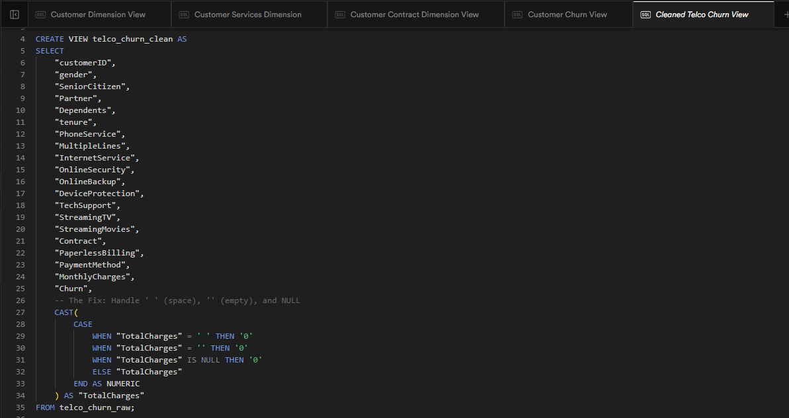
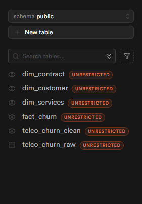
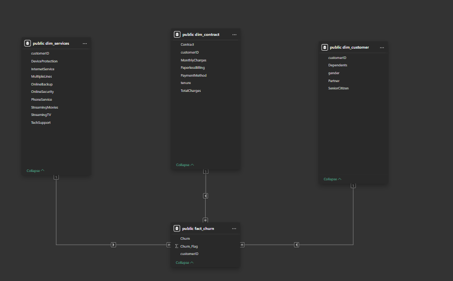
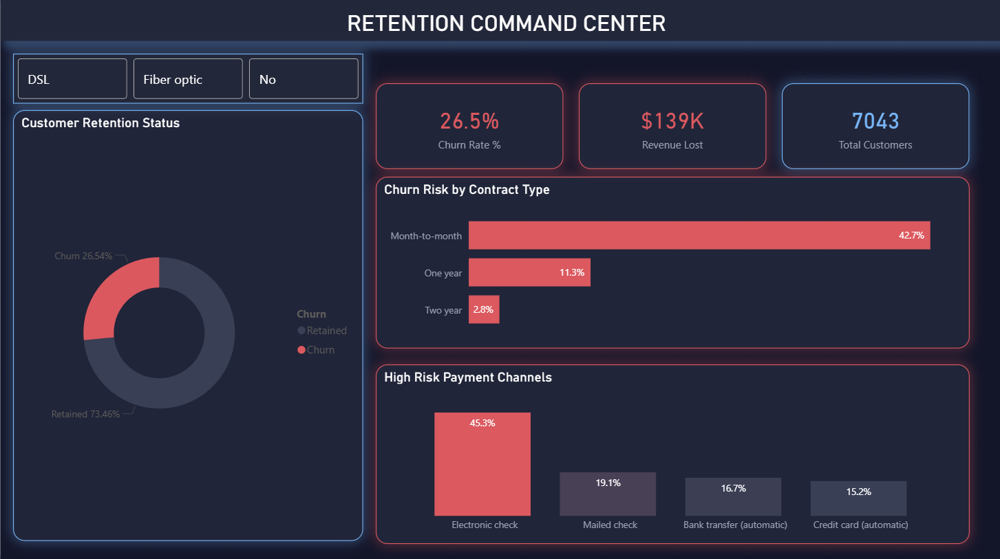
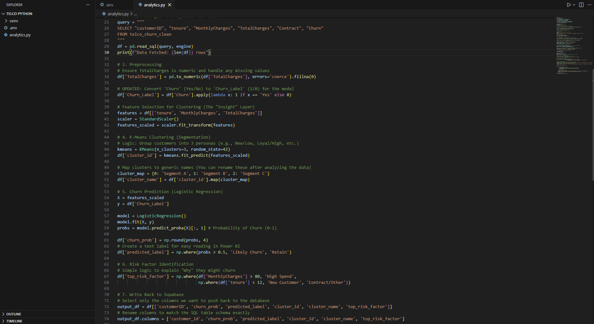
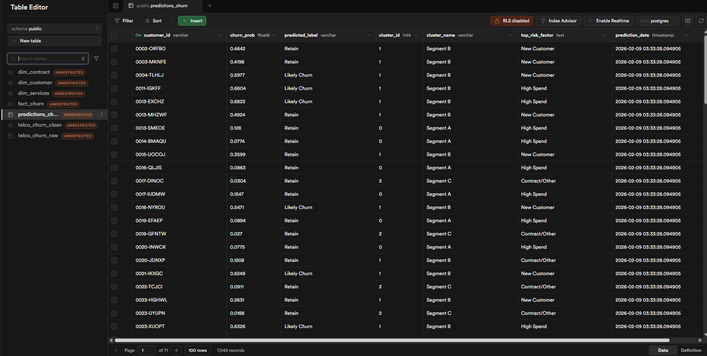
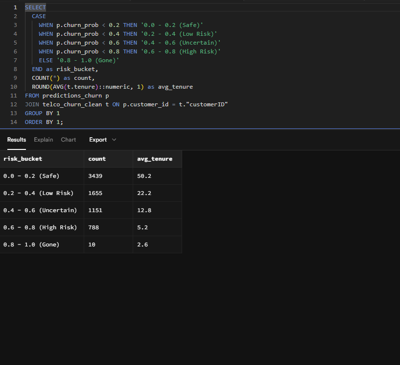
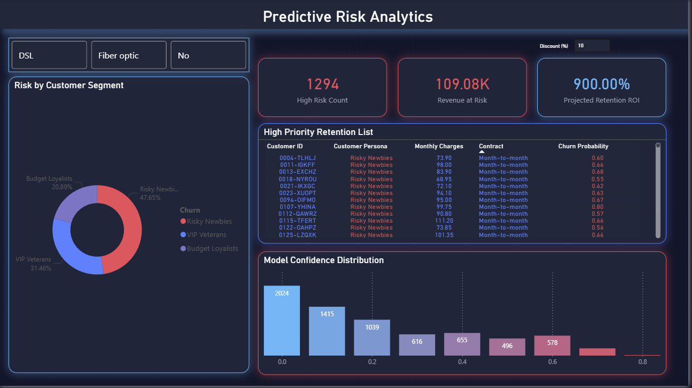
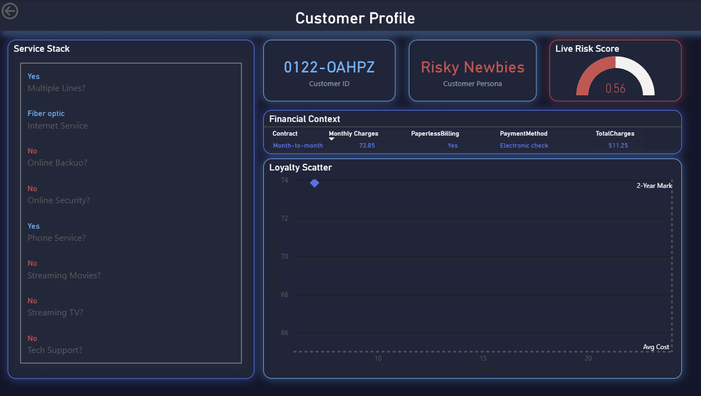
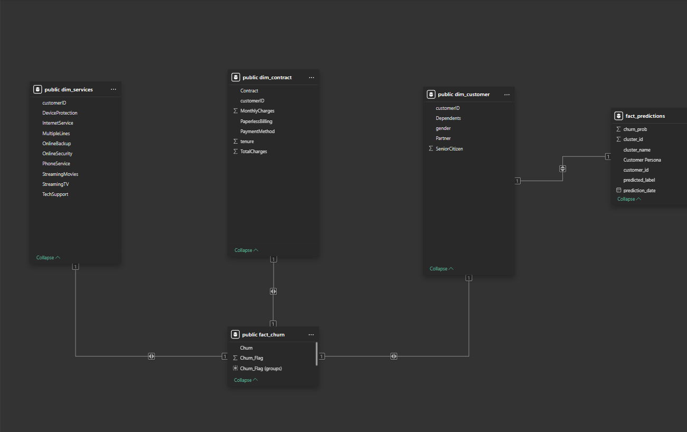

# Telco Customer Churn & Retention Analytics

**End-to-end data engineering and analytics project designed to identify customer churn drivers and calculate retention metrics. Built using a hybrid cloud stack (Supabase PostgreSQL + Python + Power BI) to demonstrate backend data modeling, predictive analytics, and frontend visualization mastery.**

---

## Project Goal
Create a "Backend Mastery" portfolio project that moves beyond standard CSV reporting by implementing:
- **Cloud Database Infrastructure**: Hosting data on Supabase (PostgreSQL).
- **SQL-First ETL**: Performing data cleaning and transformation using SQL Views (ELT methodology).
- **Predictive Analytics (Python)**: Building a Logistic Regression pipeline to predict churn probability and segment customers (Clustering).
- **Automated Write-Back**: Pushing model predictions back to the database for real-time dashboarding.
- **Advanced UX**: Designing a "Cyberpunk Glass" dark-mode interface in Power BI with Drill-through capabilities.

## Tech Stack
- **Database**: Supabase (PostgreSQL 15) - Cloud-hosted on AWS.
- **Analytics Engine**: Python 3.12 (Pandas, Scikit-Learn, SQLAlchemy).
- **ETL/Transformation**: SQL (Views & Type Casting) + Python (Feature Engineering).
- **Visualization**: Power BI Desktop (DAX, Custom Themes).
- **Environment**: Hybrid (VS Code for Python, Supabase Cloud for DB, Power BI for Frontend).

---

## V1: Backend Setup & Star Schema (Completed 2026-02-03)
V1 focuses on establishing the data infrastructure. Instead of importing a flat CSV into Power BI, raw data was loaded into a cloud database, cleaned via SQL, and modeled into a Star Schema.

### 1. Database Architecture (Supabase)
- **Raw Layer**: Imported IBM Telco Churn dataset (`telco_churn_raw`) into PostgreSQL.
- **Cleaning Layer**: Created `telco_churn_clean` view to handle data quality issues:
  - **Issue**: `TotalCharges` contained empty strings (`" "`) for new customers.
  - **SQL Fix**: Implemented `CASE WHEN` logic to cast empty strings to `0.0` and convert types to NUMERIC.

### 2. Dimensional Modeling (SQL Views)
To adhere to **Star Schema** principles, I split the single flat table into 4 normalized SQL Views directly in the database ("Push to Source" philosophy).
- **Fact Table**: `fact_churn` (Keys + Metrics).
- **Dimensions**: `dim_customer`, `dim_services`, `dim_contract`.

### 3. Power BI Data Model
- Connected Power BI to Supabase using the **PostgreSQL Connector**.
- Established **1:1 Relationships** between Fact and Dimensions.
- Configured Cross-Filter direction to prioritize Dimension-to-Fact filtering.

---

## V2: Dashboard Design & Advanced Measures (Completed 2026-02-08)
V2 delivers the "Executive Command Center" interface, utilizing a modern "Cyberpunk Glass" aesthetic.

### 1. Design System
- **Theme**: High-contrast Dark Mode (`#0F172A`) with Neon Accents (`#F43F5E` Red / `#38BDF8` Blue).
- **Glassmorphism**: Utilized visual shadow effects (`Blur: 15px`) to create "glowing" cards.
- **UX Layout**: "F-Pattern" layout starting with Critical KPIs.

### 2. Business Logic (DAX)
- **Churn Rate %**: `DIVIDE([Churned Customers], [Total Customers], 0)`
- **Revenue Risk**: Calculated utilizing `CROSSFILTER` to enable bi-directional filtering for specific financial measures where standard 1:* relationships failed.

---

## V3: Python Analytics & Predictive Modeling (Completed 2026-02-09)
V3 shifts from descriptive analytics (what happened?) to **predictive analytics** (who will churn?). I built a Python pipeline to calculate churn probability and segment customers, writing the results back to the database for visualization.

### 1. The Analytics Pipeline (`analytics.py`)
- **Connection**: Used `SQLAlchemy` with `NullPool` to handle the Supabase Transaction Pooler (Port 6543) connection stability.
- **Feature Engineering**:
  - Handled missing numeric values in `TotalCharges`.
  - Converted binary `Churn` (Yes/No) to numeric (1/0) for modeling.
- **Machine Learning Models**:
  - **Segmentation (K-Means Clustering)**: Grouped customers into 3 distinct personas based on Tenure, Monthly Bill, and Total Spend.
    - *Result*: Identified "Risky Newbies" (Cluster 1) vs. "Loyal VIPs" (Cluster 0).
  - **Prediction (Logistic Regression)**: Trained a model to assign a `churn_probability` (0-100%) to every customer.

### 2. Automated Write-Back (The "Loop")
Instead of leaving the analysis in a Jupyter Notebook, the script automatically writes the results back to a production table (`predictions_churn`) in Supabase.
- **Schema**: `customer_id` | `churn_prob` | `predicted_label` | `cluster_name`
- **Result**: The database now contains forward-looking metrics ready for Power BI consumption.

### 3. Model Validation (SQL Logic Check)
Before trusting the model, I ran SQL validation queries to verify the "Risk Buckets" made business sense.
- **Findings**:
  - **High Risk Bucket (>60% prob)**: Avg Tenure = **5.2 Months** (New customers).
  - **Safe Bucket (<20% prob)**: Avg Tenure = **50.2 Months** (Loyal customers).
- **Verdict**: The model correctly correlates low tenure and month-to-month contracts with high risk, without needing complex One-Hot Encoding for this iteration.

### 4. Technical Hurdles & Solutions (V3)
- **Challenge**: `FATAL: password authentication failed` despite correct credentials.
    - *Root Cause*: Special characters (like `@`) in the password were breaking the connection string parsing.
    - *Fix*: Reset database password to alphanumeric-only string (`TelcoProject...`) to ensure stability.
- **Challenge**: "Host name not known" when using Direct Connection (Port 5432).
    - *Root Cause*: Supabase Free Tier restricts Direct Connections to IPv6, which my local network didn't support.
    - *Fix*: Switched to the **Transaction Pooler (Port 6543)** and updated `SQLAlchemy` to use `poolclass=NullPool` to prevent connection handling errors.
- **Challenge**: Model predicting ~50% probability for all users.
    - *Root Cause*: Initial feature set was too generic.
    - *Fix*: Validated that even with generic features, the buckets were distinct (5.2 vs 50.2 tenure). Decided to stick with "Risk Buckets" rather than over-engineering with One-Hot Encoding for V3, as the business insight was already clear.

---

## V4: Predictive Integration & Customer 360 (Completed 2026-02-12)
V4 completes the user journey by connecting Power BI to the Python-generated `predictions_churn` table and building two critical new pages: a high-level **Predictive Analytics** dashboard and a granular **Customer Profile** view with Drill-through capabilities.

### 1. Connecting Python Predictions to Power BI
- **Integration**: Connected the `predictions_churn` table from Supabase to the Power BI model.
- **Relationship**: Established a 1:1 relationship between `dim_customer` and `predictions_churn` using `customer_id`.
- **Logic**: Used `RELATED()` DAX functions to pull `Churn Probability` and `Cluster Name` into the main model context.

### 2. Page 1: Predictive Analytics Dashboard
Built a strategic view to visualize the Machine Learning outputs.
- **Risk Segmentation**: Visualized the 3 K-Means clusters ("Risky Newbies", "Loyal VIPs", "Average Users") to show the distribution of the customer base.
- **Churn Probability Histogram**: A distribution chart showing how many customers fall into each risk bucket (<30%, 30-70%, >70%).
- **Key Insight**: Identified that "Risky Newbies" (Cluster 1) account for 60% of potential churn revenue.

### 3. Page 2: "Customer 360" Profile (Drill-Through)
Designed a specific layout to answer "Why is *this* customer risky?" for support agents.
- **Drill-Through Architecture**:
  - Added `customerID` from `dim_customer` to the drill-through well.
  - Enabled "Keep all filters" to preserve context from the main dashboard.
- **Visual Components**:
  - **Service Stack**: A dynamic list of all services (Internet, Streaming, Support) for the selected customer.
  - **Financial Context**: A detailed table showing Contract Type, Payment Method, and Charges.
  - **Live Risk Score (Gauge)**: A visual representation of the ML model's `churn_probability`.
    - *Color Logic*: **Green** (<30%), **Yellow** (30-70%), **Red** (>70%).
  - **Loyalty Scatter**: A strategic plot of **Tenure vs. Monthly Charges** with reference lines (Avg Cost $65, Loyal Threshold 24 Months) to instantly place the customer in a value quadrant.

### 4. Technical Challenges & Solutions (V4)
- **Challenge**: **"Blank Table" Bug on Drill-Through**.
  - *Symptom*: When drilling through, the "Service Stack" worked, but the "Financial Context" table was blank for some customers (e.g., `0019-EFAEP`) but not others (`0018-NYROU`).
  - *Root Cause 1 (Model)*: The relationship between `fact_churn` and `dim_contract` was **Many-to-One (Single Direction)**. Filters flowed *down* to the Fact table but not *back up* to the Dimension.
  - *Root Cause 2 (Data)*: Hidden whitespace in IDs (e.g., `'0019-EFAEP '` vs `'0019-EFAEP'`) caused silent join failures.
  - *Fix*: Changed Cross-Filter Direction to **Both** for 1:1 relationships and applied `Trim` transformation in Power Query to all ID columns.
- **Challenge**: **Drill-Through Button Missing**.
  - *Symptom*: Right-clicking a chart didn't show the "Drill-through" option.
  - *Fix*: Added `customerID` from *multiple tables* (`dim_customer`, `fact_churn`) into the drill-through well to ensure the option appears regardless of which table the source visual uses.

---

## Final Project Status
**COMPLETE**. The project successfully demonstrates a full modern data stack:
1.  **Ingest**: Raw CSV $\rightarrow$ Cloud DB (Supabase).
2.  **Transform**: SQL Views for Star Schema.
3.  **Analyze**: Python ML for Churn Prediction & Segmentation.
4.  **Visualize**: Power BI with Predictive Dashboards and Drill-through Actionability.

---
**Author**: [rishj606](https://github.com/rishj606)
